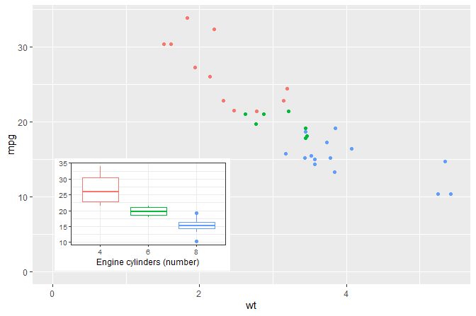
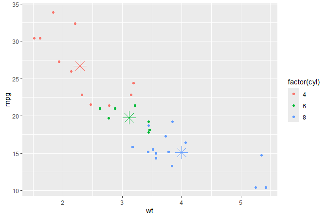
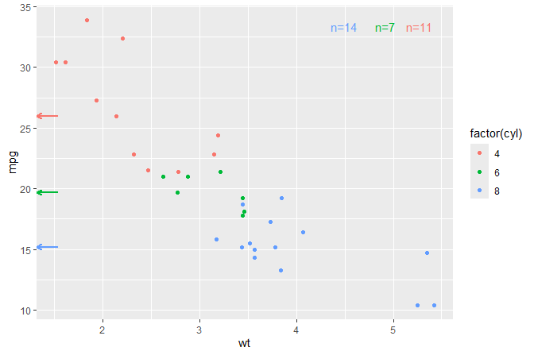
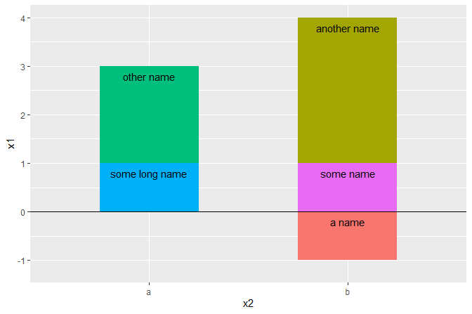

# ggpp 

<!-- badges: start -->

[](https://cran.r-project.org/package=ggpp)
[](https://cran.r-project.org/web/checks/check_results_ggpp.html)
[](https://aphalo.r-universe.dev/ggpp)
[](https://github.com/aphalo/ggpp/actions/workflows/R-CMD-check.yaml)
[](https://raw.githubusercontent.com/aphalo/ggpp/_xml_coverage_reports/data/master/coverage.xml)
[](https://docs.r4photobiology.info/ggpp/)
[](https://doi.org/10.32614/CRAN.package.ggpp)
<!-- badges: end -->

## Purpose

Package ‘**ggpp**’ provides a set of building blocks that extend the
Grammar of Graphics implemented in package ‘ggplot2’ (\>= 3.5.0). The
extensions enhance the support of data labels and annotations in plots.
Position functions implement new approaches to nudging usable with any
geometry, but especially useful together with `geom_text_s()` and
`geom_label_s()` from this package and `geom_text_repel()` and
`geom_label_repel()` from package ‘ggrepel’ (\>= 0.9.2). See:
(<https://ggrepel.slowkow.com>) for installation instructions and news
about releases.

## NPC support in ggplot2

**Normalised Parent Coordinates (NPC) are supported natively by
‘ggplot2’ \>= 3.5.0 by means of R’s identity function `I()`. This new
approach does not require special geometries as it should work with
almost every existing geometry. However, currently this works only when
continuous variables are mapped to the *x* and/or *y* aesthetics. If
this mechanism is extended to support factors and other discrete
variables in the future , all the `_npc` geometries from ‘ggpp’ could
become redundant. Meanwhile, these special geometries from ‘ggpp’ still
fill a gap, albeit a smaller one, in the support of NPC by ‘ggplot2’.**

## Extended Grammar of graphics

### Geometries

The distinction between observations or data mapped to *x* and *y*
aesthetics and data labels is that data labels are linked to a the
coordinates of the data, but their own location is usually nearby but
not exactly that of the data. In other words the location of a data
label in *x* and *y* coordinates is flexible as long as the link to a
data observation can be inferred. In the case of annotations the
location on the plotting area is arbitrary, dictated by available
graphic design considerations and the requirement of not occluding data
observations. In the table below we list for the geometries defined in
package ‘ggpp’: 1) whether they are intended for data labels,
annotations or data, 2) the aesthetics and pseudo-aesthetics they obey,
and 3) whether they can connect the original data position to the
displaced position. The drawing of connecting segments or arrows between
the displaced and original positions, those of the observation and the
displaced label, requires also a change in the data returned by position
functions (see the next section).

| Geometry | Main use | Aesthetics | Segment |
|----|----|----|----|
| `geom_text_s()` | data labels | x, y, label, size, family, font face, colour, alpha, group, angle, vjust, hjust | yes |
| `geom_label_s()` | data labels | x, y, label, size, family, font face, colour, fill, alpha, linewidth, linetype, group, vjust, hjust | yes |
| `geom_text_pairwise()` | data labels | x, xmin, xmax, y, label, size, family, font face, colour, alpha, group, angle, vjust, hjust | horiz. |
| `geom_label_pairwise()` | data labels | x, xmin, xmax, y, label, size, family, font face, colour, fill, alpha, linewidth, linetype, group, vjust, hjust | horiz. |
| `geom_point_s()` | data labels | x, y, size, colour, fill, alpha, shape, stroke, group | yes |
| `geom_table()`<sup>1</sup> | data labels | x, y, label, size, family, font face, colour, alpha, group, angle, vjust, hjust | yes |
| `geom_plot()`<sup>1</sup>, `geom_grob()`<sup>1</sup> | data labels | x, y, label, group, angle, vjust, hjust | yes |
| `geom_margin_arrow()` | data labels, scale labels, data | xintercept, yintercept, label, size, family, font face, colour, alpha, group, vjust, hjust | no |
| `geom_margin_point()` | data labels, scale labels, data | xintercept, yintercept, label, size, family, font face, colour, alpha, group, vjust, hjust | no |
| `geom_margin_grob()` | data labels, scale labels, data | xintercept, yintercept, label, size, family, font face, colour, alpha, group, vjust, hjust | no |
| `geom_quadrant_lines()` , `geom_vhlines()` | data labels, scale labels, data | xintercept, yintercept, label, size, family, font face, colour, alpha, group, vjust, hjust | no |

Geometries defined in package ‘ggpp’. <sup>1</sup> NPC versions exist
for these geometries, as well as for `geom_text()` and `geom_label()`,
used mainly for plot annotations.

## Position functions

In contrast to position functions from ‘ggplot2’ all the position
functions from package ‘ggpp’ are able keep the original *x* and *y*
coordinates under a different name in the `data` object when displacing
them to a new position. This makes them compatible with `geom_text_s()`,
`geom_label_s()`, `geom_point_s()`, `geom_table()`, `geom_plot()` and
`geom_grob()` from this package. All these geoms can draw segments or
arrows connecting the original positions to the displaced positions.
They remain backwards compatible and can be used in all geometries that
have a `position` formal parameter. This is similar to the approach used
in package ‘ggrepel’ (\<= 0.9.1) but uses a different naming convention
that allows the new position functions to remain backwards compatible
with ‘ggplot2’. Starting from version 0.9.2 geometries
`geom_text_repel()` and `geom_label_repel()` from package ‘ggrepel’ are
fully compatible with this new naming convention.

Position functions `position_nudge_keep()`, `position_nudge_to()`,
`position_nudge_center()` and `position_nudge_line()` implement
different flavours of nudging. The last two functions make it possible
to apply nudging that varies automatically according to the relative
position of data points with respect to arbitrary points or lines, or
with respect to a polynomial or smoothing spline fitted on-the-fly to
the the observations.

Position functions `position_stacknudge()`, `position_fillnudge()`,
`position_jitternudge()`, `position_dodgenudge()` and
`position_dodge2nudge()` combine each the roles of two *position*
functions. They make it possible to easily nudge labels in plot layers
that use stacking, dodging or jitter. Functions
`position_jitter_keep()`, `position_stack_keep()`,
`position_fill_keep()`, `position_dodge_keep()`,
`position_dosge2_keep()` behave like the positions from ‘ggplot2’ but
keep in the `data` object the original coordinates.

| Position | Main use | Displacement | Most used with |
|----|----|----|----|
| `position_nudge_keep()` | nudge | x, y (fixed distance) | data labels |
| `position_jitter_keep()` | jitter | x, y (random) | dot plots |
| `position_stack_keep()` | stack | vertical (absolute) | column and bar plots |
| `position_stack_minmax()` | stack | vertical (absolute) | error bars |
| `position_fill_keep()` | fill | vertical (relative, fractional) | column plots |
| `position_dodge_keep()` | dodge | sideways (absolute) | column and bar plots |
| `position_dosge2_keep()` | dodge2 | sideways (absolute) | box plots |
| `position_nudge_to()` | nudge | x, y (fixed position) | data labels |
| `position_nudge_center()` | nudge | x, y (away or towards target) | data labels |
| `position_nudge_line()` | nudge | x, y (away or towards target) | data labels |
| `position_stacknudge()` | stack + nudge | combined, see above | data labels in column plots |
| `position_fillnudge()` | fill + nudge | combined, see above | data labels in column plots |
| `position_jitternudge()` | jitter + nudge | combined, see above | data labels in dot plots |
| `position_dodgenudge()` | dodge + nudge | combined, see above | data labels in column plots |
| `position_dodge2nudge()` | dodge2 + nudge | combined, see above | data labels in box plots |

Position functions defined in package ‘ggpp’.

### Statistics

Statistic `stat_fmt_tb()` helps with the formatting of tables to be
plotted with `geom_table()`.

Four statistics, `stat_dens2d_filter()`, `stat_dens2d_label()`,
`stat_dens1d_filter()` and `stat_dens1d_label()`, implement tagging or
selective labeling of observations based on the local 2D density of
observations in a panel. Another two statistics,
`stat_dens1d_filter_g()` and `stat_dens1d_filter_g()` compute the
density by group instead of by plot panel. These six statistics are
designed to work well together with `geom_text_repel()` and
`geom_label_repel()` from package ‘ggrepel’ (\>= 0.8.0).

The statistics `stat_apply_panel()` and `stat_apply_group()` are useful
for applying arbitrary functions returning numeric vectors like
`cumsum()`, `cummax()` and `diff()`. Statistics `stat_centroid()` and
`stat_summary_xy()` allow computation of summaries on both *x* and *y*
and passing them to a geom.

The statistics `stat_quadrant_counts()` and `stat_panel_counts()` make
it easy to annotate plots with the number of observations.

| Statistic | Main use | Usual geometries | Most used with | Compute function |
|----|----|----|----|----|
| `stat_fmt_tb()` | formatting and selection | `geom_table()` | tables as data labels | group |
| `stat_fmt_tb()` | formatting and selection | `geom_table_npc()` | tables as annotations | group |
| `stat_dens2d_filter()` | local 2D density filtering | `geom_text_s()`, `geom_label_s()`, `geom_text()`, `geom_label()` | text as data labels | panel |
| `stat_dens2d_label()` | local 2D density filtering | `geom_text_repel()`, `geom_label_repel()` | text as data labels | panel |
| `stat_dens1d_filter()` | local 1D density filtering | `geom_text_s()`, `geom_label_s()`, `geom_text()`, `geom_label()` | text as data labels | panel |
| `stat_dens1d_label()` | local 1D density filtering | `geom_text_repel()`, `geom_label_repel()` | text as data labels | panel |
| `stat_dens2d_filter_g()` | local 2D density filtering | `geom_text_s()`, `geom_label_s()`, `geom_text()`, `geom_label()` | text as data labels | group |
| `stat_dens2d_label_g()` | local 2D density filtering | `geom_text_repel()`, `geom_label_repel()` | text as data labels | group |
| `stat_dens1d_filter_g()` | local 1D density filtering | `geom_text_s()`, `geom_label_s()`, `geom_text()`, `geom_label()` | text as data labels | group |
| `stat_dens1d_label_g()` | local 1D density filtering | `geom_text_repel()`, `geom_label_repel()` | data labels | group |
| `stat_panel_counts()` | number of observations | `geom_text()`, `geom_label()` | text as annotation | panel |
| `stat_group_counts()` | number of observations | `geom_text()`, `geom_label()` | text as annotation | panel |
| `stat_quadrant_counts()` | number of observations | `geom_text()`, `geom_label()` | text as annotation | panel |
| `stat_apply_panel()` | cummulative summaries | `geom_point()`, `geom_line()`, etc. | scatter and line plots | panel |
| `stat_apply_group()` | cummulative summaries | `geom_point()`, `geom_line()`, etc. | scatter and line plots | group |
| `stat_centroid()` | joint x and y summaries | `geom_point()`, `geom_rug()`, `geom_margin_arrow()`, etc. | data summary | group |
| `stat_summary_xy()` | joint x and y summaries | `geom_point()`, `geom_rug()`, `geom_margin_arrow()`, etc. | data summary | group |
| `stat_functions()` | compute y from x range | `geom_line()`, `geom_point()`, etc. | draw function curves | group |

Statistics defined in package ‘ggpp’.

## Justification

Justifications `"outward_mean"`, `"inward_mean"`, `"outward_median"` and
`"inward_median"` implement outward and inward justification relative to
the centroid of the data instead of to the center of the $x$ or $y$
scales. Justification outward or inward from an arbitrary origin is also
supported. Justification `"position"` implements justification at the
edge nearest to the original position. This works only together with
position functions that save the original location using the naming
convention implemented in ‘ggpp’, otherwise default justification
falls-back to `"center"`/`"middle"`.

## History

This package is a “spin-off” from package ‘ggpmisc’ containing
extensions to the grammar originally written for use wihtin ‘ggpmisc’.
As ‘ggpmisc’ had grown in size, splitting it into two packages was
necessary to easy development and maintenance and to facilitate imports
into other packages. For the time being, package ‘ggpmisc’ imports and
re-exports all visible definitions from ‘ggpp’.

## Examples

The plots below exemplify some of the things that ‘ggpp’ makes possible
or makes easier to code compared to ‘ggplot’ used on its own. Additional
examples including several combining ‘ggpp’ and ‘ggrepel’ are provided
in the package vignette.

``` r
library(ggpp)
library(ggrepel)
library(dplyr)
```

### Insets

A plot with an inset table.

``` r
mtcars %>%
  group_by(cyl) %>%
  summarize(wt = mean(wt), mpg = mean(mpg)) %>%
  ungroup() %>%
  mutate(wt = sprintf("%.2f", wt),
         mpg = sprintf("%.1f", mpg)) -> tb

df <- tibble(x = 5.45, y = 34, tb = list(tb))

ggplot(mtcars, aes(wt, mpg, colour = factor(cyl))) +
  geom_point() +
  geom_table(data = df, aes(x = x, y = y, label = tb))
```

<!-- -->

A plot with an inset plot.

Inset plot positioned using native plot coordinates (npc) using
numerical values in the range 0..1 together with `I()`.

``` r
p <- ggplot(mtcars, aes(factor(cyl), mpg, colour = factor(cyl))) +
  stat_boxplot() +
  labs(y = NULL, x = "Engine cylinders (number)") +
  theme_bw(9) + theme(legend.position = "none")

ggplot(mtcars, aes(wt, mpg, colour = factor(cyl))) +
  geom_point(show.legend = FALSE) +
  annotate("plot", x = I(0.05), y = I(0.05), label = p, 
           hjust = "inward", vjust = "inward") +
  expand_limits(y = 0, x = 0)
```

<!-- -->

### Centroids

Means computed on-the-fly and shown as asterisks.

``` r
ggplot(mtcars, aes(wt, mpg, colour = factor(cyl))) +
  geom_point() +
  stat_centroid(shape = "asterisk", size = 6)
```

<!-- -->

Medians computed on-the-fly shown as marginal arrows. Labels with number
of observations per group.

``` r
ggplot(mtcars, aes(wt, mpg, colour = factor(cyl))) +
  geom_point() +
  stat_centroid(geom = "y_margin_arrow", .fun = median,
                aes(yintercept = after_stat(y)), arrow.length = 0.05) +
  stat_group_counts(vstep = 0, hstep = 0.09)
```

<!-- -->

### Nudging and stacking combined

``` r
df <- data.frame(x1 = c(1, 2, 1, 3, -1),
                 x2 = c("a", "a", "b", "b", "b"),
                 grp = c("some long name", "other name", "some name",
                         "another name", "a name"))

# Add labels to a horizontal column plot (stacked by default)
ggplot(data = df, aes(x2, x1, group = grp)) +
  geom_col(aes(fill = grp), width=0.5) +
  geom_hline(yintercept = 0) +
  geom_text(
    aes(label = grp),
    position = position_stacknudge(vjust = 1, y = -0.2)) +
  theme(legend.position = "none")
```

<!-- -->

## Installation

Installation of the most recent stable version from CRAN (sources, Mac
and Win binaries):

``` r
install.packages("ggpp")
```

Installation of the current unstable version from R-Universe CRAN-like
repository (binaries for Mac, Win, Webassembly, and Linux, as well as
sources available):

``` r
install.packages('ggpp', 
                 repos = c('https://aphalo.r-universe.dev', 
                           'https://cloud.r-project.org'))
```

Installation of the current unstable version from GitHub (from sources):

``` r
# install.packages("devtools")
devtools::install_github("aphalo/ggpp")
```

## Documentation

HTML documentation for the package, including help pages and the *User
Guide*, is available at (<https://docs.r4photobiology.info/ggpp/>).

News about updates are posted at (<https://www.r4photobiology.info/>).

Chapter 7 in Aphalo (2020) and Chapter 9 in Aphalo (2024) explain basic
concepts of the grammar of graphics as implemented in ‘ggplot2’ as well
as extensions to this grammar including several of those made available
by packages ‘ggpp’ and ‘ggpmisc’. Information related to the book is
available at <https://www.learnr-book.info/>.

## Contributing

Please report bugs and request new features at
(<https://github.com/aphalo/ggpp/issues>). Pull requests are welcome at
(<https://github.com/aphalo/ggpp>).

## Citation

If you use this package to produce scientific or commercial
publications, please cite according to:

``` r
citation("ggpp")
#> To cite package 'ggpp' in publications use:
#> 
#>   Aphalo P (2024). _ggpp: Grammar Extensions to 'ggplot2'_. R package
#>   version 0.5.8-1, <https://CRAN.R-project.org/package=ggpp>.
#> 
#> A BibTeX entry for LaTeX users is
#> 
#>   @Manual{,
#>     title = {ggpp: Grammar Extensions to 'ggplot2'},
#>     author = {Pedro J. Aphalo},
#>     year = {2024},
#>     note = {R package version 0.5.8-1},
#>     url = {https://CRAN.R-project.org/package=ggpp},
#>   }
```

## Acknowledgements

Being an extension to package ‘ggplot2’, some of the code in package
‘ggpp’ has been created by using as a template that from layer functions
and scales in ‘ggplot2’. The user interface of ‘ggpp’ aims at being as
consistent as possible with ‘ggplot2’ and the layered grammar of
graphics (Wickham 2010). New features added in ‘ggplot2’ are added when
relevant to ‘ggpp’, such as support for `orientation` for flipping of
layers. This package does consequently indirectly include significant
contributions from several of the authors and maintainers of ‘ggplot2’,
listed at (<https://ggplot2.tidyverse.org/>).

Coordination of development through a friendly exchange of ideas and
reciprocal contributions by Kamil Slowikowski to ‘ggpp’ and by myself to
‘ggrepel’ has made the two packages fully inter-compatible.

## References

Aphalo, Pedro J. (2024) *Learn R: As a Language.* 2ed. The R Series.
Boca Raton and London: Chapman and Hall/CRC Press. ISBN: 9781032516998.
466 pp.

Aphalo, Pedro J. (2020) *Learn R: As a Language.* 1ed. The R Series.
Boca Raton and London: Chapman and Hall/CRC Press. ISBN: 9780367182533.
350 pp.

Wickham, Hadley. 2010. “A Layered Grammar of Graphics.” Journal of
Computational and Graphical Statistics 19 (1): 3–28.
<https://doi.org/10.1198/jcgs.2009.07098>.

## License

© 2016-2024 Pedro J. Aphalo (<pedro.aphalo@helsinki.fi>). Released under
the GPL, version 2 or greater. This software carries no warranty of any
kind.
